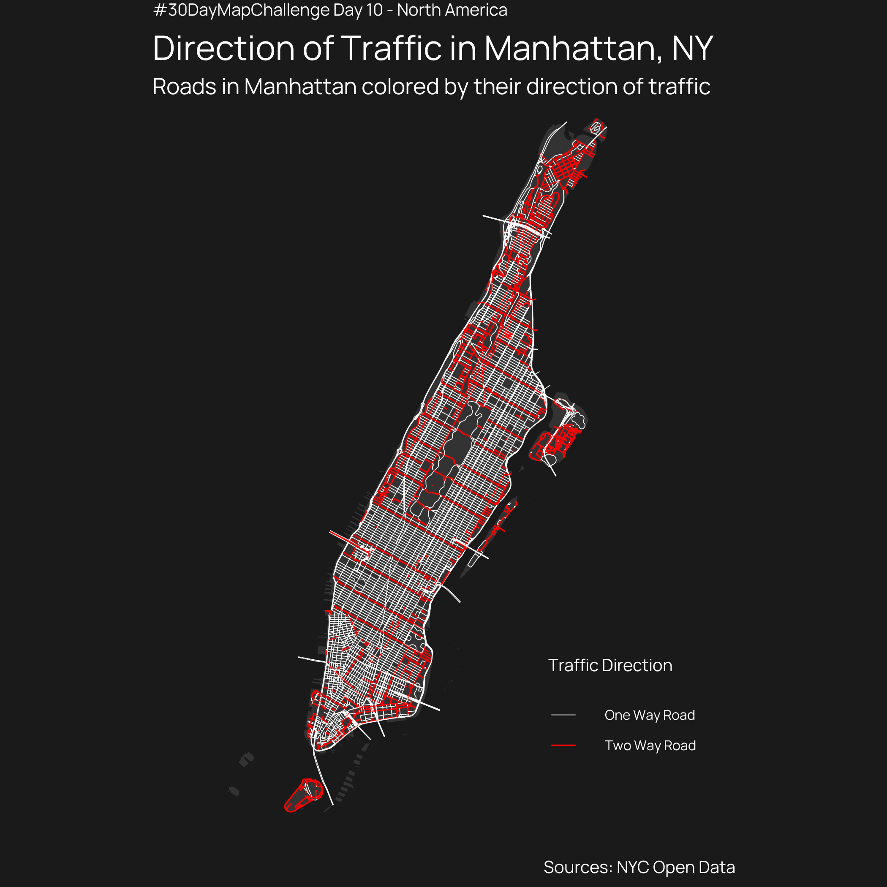
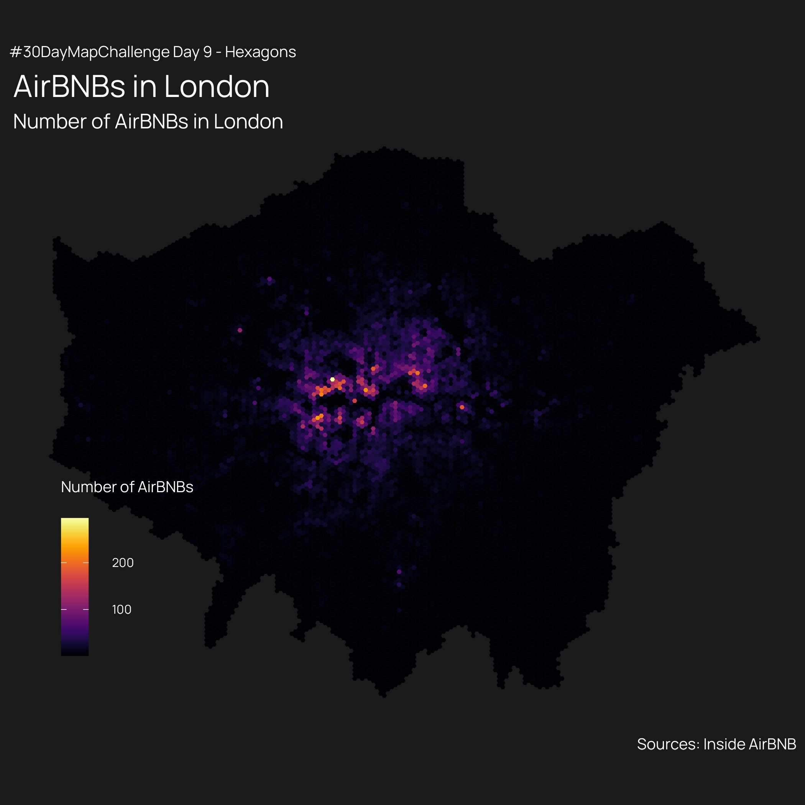
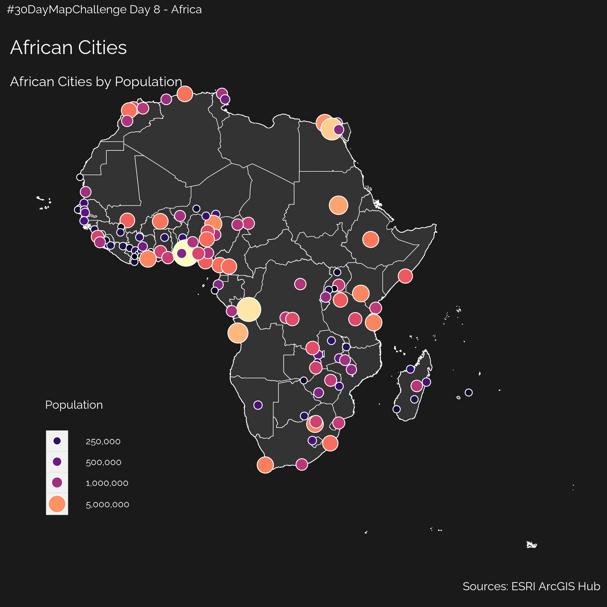
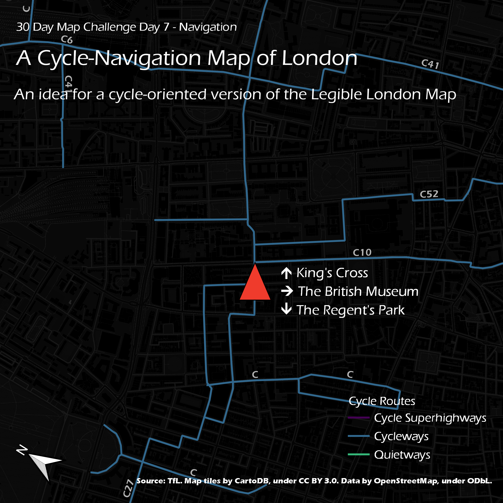
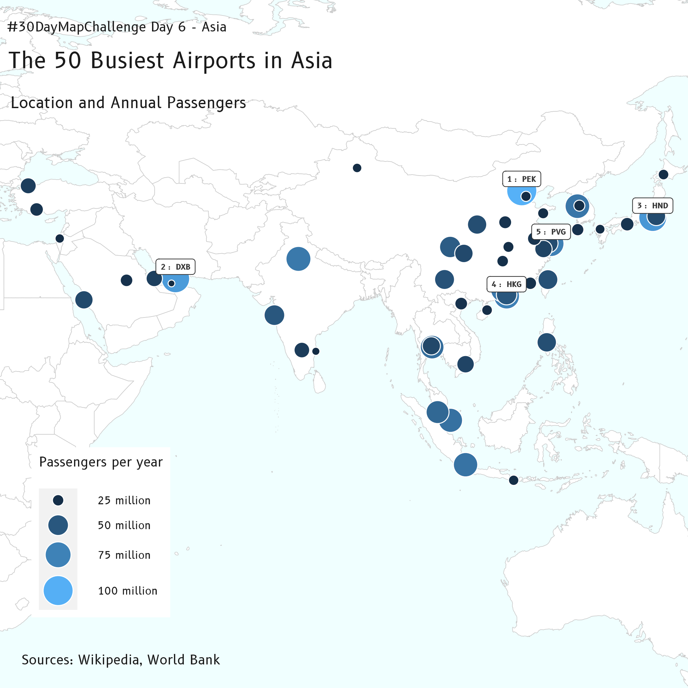
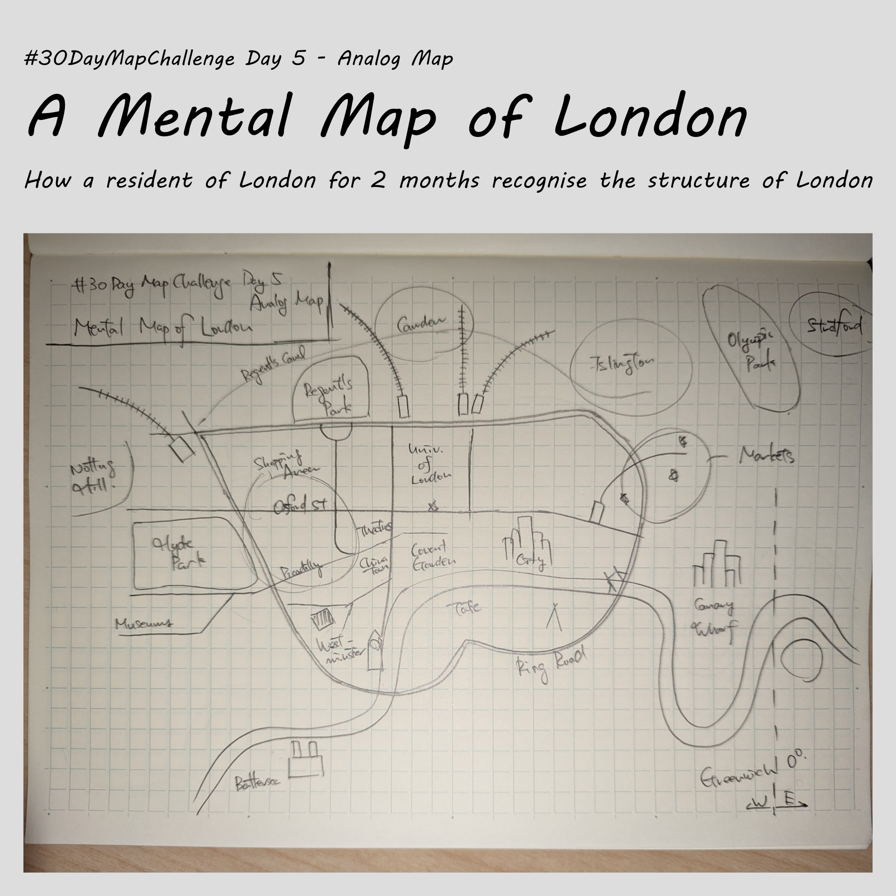
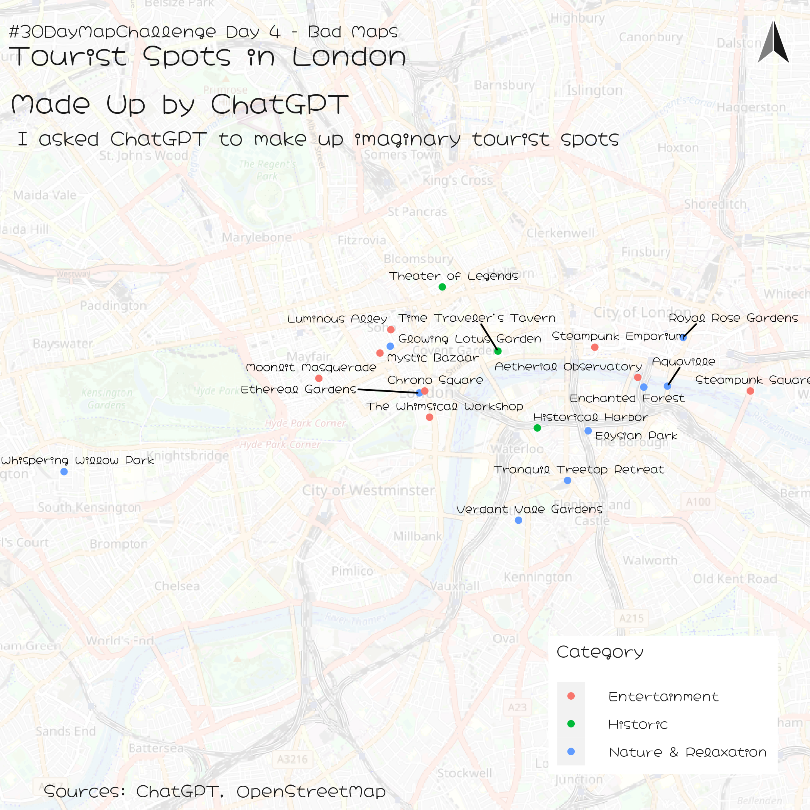
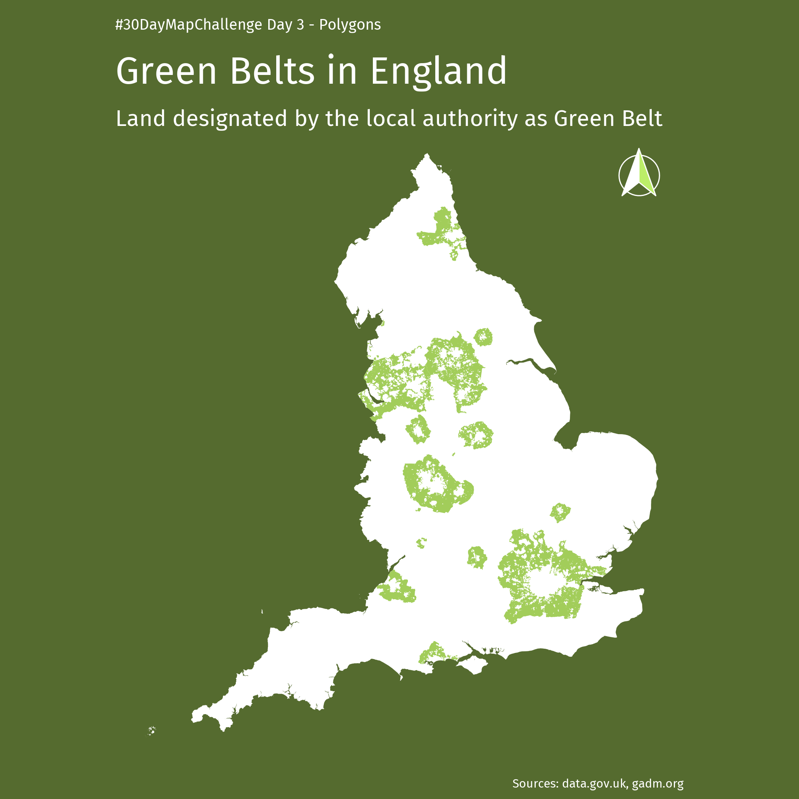
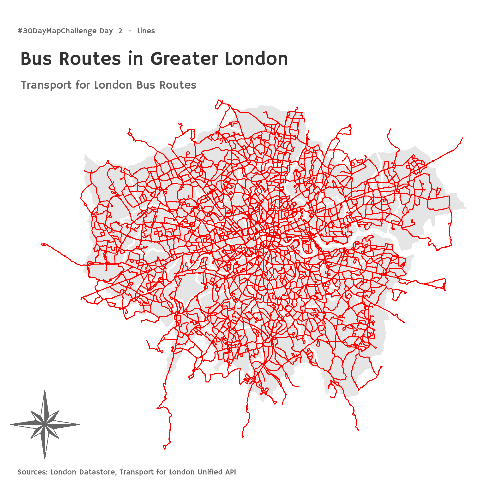
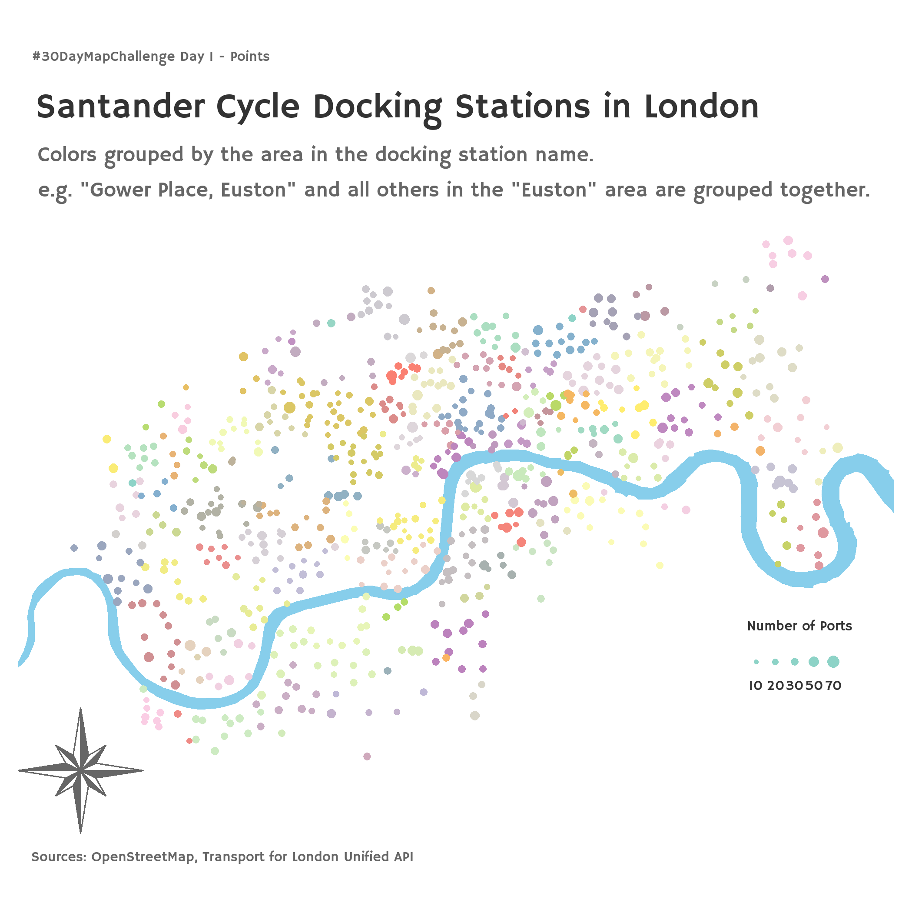

# 30DayMapChallenge

This is my contribution to the #30DayMapChallenge for November 2023.\
About the #30DayMapChallenge , check out <https://30daymapchallenge.com/> !

## Introduction

### About me

I am a postgraduate student studying GIS and data science at UCL, trying to learn R, python, and making use of GitHub.\
Background in planning, new to London from Japan, some knowledge about QGIS, and interested in graphic design (trying to make the maps as aesthetic as possible!)

### This repository is:

-   where I will be uploading my maps!
-   where I will be uploading my code as well
-   my first public repository on GitHub
-   my first project using R and python

The data itself will not be uploaded due to limitations in file size, but I will try to be as reproducible as possible (but this might happen later.)

### My goals

Through the #30DayMapChallenge I want to: - be more familiar with R and python to draw maps using code. I will try to stay away from QGIS and Illustrator, although it is tempting to use them... - also be familiar with other software that I don't know. Blender might be one of them. - know more about London, the UK and Europe. The datasets will probably feature London and surrounding areas a lot. Some data might come from Japan. - know where to get data. Any recommendations are appreciated!

## The Maps

### Day 10: North America

When I was in elementary school, I used to live in Westchester County just north of New York City. Back then I didn't know about this field of GIS or geography (well I did spend some time playing SimCity, if that counts), so I decided to revisit New York with a geospatial lens!

The grid in Manhattan is famous for its one-way throughfare, and I mapped the rare exceptions that did carry both ways of traffic. (Yes I did not drive back then as well.)

Seems like NYC has a decent set of open geospatial data to explore...

Sources: NYC Open Data

### Day 9: Hexagons

Analysis using hexagons is totally new to me. When I was doing my undergraduate in Japan, the only grids we used were the square ones.  
As explained [here](https://pro.arcgis.com/en/pro-app/latest/tool-reference/spatial-statistics/h-whyhexagons.htm) there seems to be advantages, so I decided to give a shot.  

I mapped the number of AirBNBs in each hexagonal grid of 350 meters across.
Did some basic spatial joins, but did not expect over 200 listings in a single cell!  

Just having a dark background makes the maps a lot cooler, but my interest toward graphic design makes me want to make cool maps using a lighter theme....

Sources: London Datastore, AirBNB

### Day 8: Africa

I have never engaged with African Geospatial Data before, so I tried mapping the population of major African cities.  
ArcGIS Hub does have a lot of data, which is appreciated a lot!

Now that I have a full week of mapping code ready, it is starting to get easier to create maps using the data I already have. Now this is reproducibility!

Sources: ArcGIS Hub

### Day 7: Navigation

Wayfinding was always my interest, and this seemed like a perfect time to try!  
I have created my version of the [Legible London](https://tfl.gov.uk/info-for/boroughs-and-communities/legible-london) signs with a focus on cycle maps!  

I have made this map with QGIS for the first time in this challenge. (No codes today!)
After a week of tackling data with R, I now really appreciate the GUI of QGIS.  
(Even simple things like rotating views was hard to figure out in R.)  
I also tried a new basemap: Carto tiles!

Sources: TfL, CartoDB

### Day 6: Asia

When I think about Asia, what comes to my mind are the huge airports competing against each other for size, efficiency, and the status as the world hub.  
I have mapped the 50 largest airport by annual passengers, with labeling the top 5.  
Dealing with text using ggplot2 is still difficult for me.  

I sourced Wikipedia since no others came handy, but felt like I was betraying all my past teachers! Sorry prof!

Sources: Wikipedia, World Bank

### Day 5: Analog Map

For an analog map, I made a map of London - in a way I understand it!  
Inspired by **"The Image of the City"** I tried to draw what I know about the city, and how each component affects how I perceive it.  
Few things I noticed:
- Inside or outside of the Ring Road is a big deal to me, crossing it is another big deal (every day I do!)
- The roads and rail do help me a lot when it comes to recognition
- Cycling around the city did help me a lot!
- I know too little about the east
- I know too little about the south

I hope I get to know this city a little better in the near future!

Source: Me!

### Day 4: A Bad Map

Okay, a bad map.  
I decided to make a map with the wrong information: fake must-see spots within London!  
I asked ChatGPt to make up some spots to recommend to an innocent tourist!
It must believe that steampunk is something really big in London.
ChatGPT has made up a description for me as well. Everything is so WRONG!  
Enjoy your time in imaginary London!

Sources: ChatGPT, OpenStreetMap

#### Points of Interests

Keep in mind, this is imaginary!

##### Entertainment

| **Name**               | **Description**                                                                                                                                                         |
| ---------------------- | ----------------------------------------------------------------------------------------------------------------------------------------------------------------------- |
| Chrono Square          | A mysterious square near the River Thames, where time seems to stand still, and every clock displays a different era.                                                   |
| Luminous Alley         | A narrow, cobblestone alley in Soho that glows softly at night, rumored to be haunted by friendly ghosts that guide lost travelers.                                     |
| Mystic Bazaar          | A bustling market in Camden, where travelers can find exotic artifacts, magical trinkets, and fortune tellers predicting the future.                                    |
| Steampunk Square       | A square in Greenwich adorned with intricate steampunk sculptures and gadgets, reminiscent of a bygone industrial era.                                                  |
| Moonlit Masquerade     | An elegant ballroom in Westminster, hosting enchanting masquerade parties, live orchestras, and dance performances under the shimmering moonlight.                      |
| Theater of Legends     | A historic theater in Camden, where legendary performances from Shakespearean plays to modern dramas captivate audiences, preserving the city's theatrical heritage.    |
| Steampunk Emporium     | A steampunk-themed marketplace in Westminster, showcasing intricate gadgets, retro-futuristic fashion, and unique artifacts from the Victorian era.                     |
| The Whimsical Workshop | An imaginative workshop in Soho, where artists, inventors, and dreamers collaborate to create fantastical sculptures, whimsical gadgets, and interactive installations. |

##### Nature & Relaxation

| **Name**                 | **Description**                                                                                                                                              |
| ------------------------ | ------------------------------------------------------------------------------------------------------------------------------------------------------------ |
| Ethereal Gardens         | A magical garden hidden behind the façade of an old bookstore in the heart of Covent Garden, where rare and mythical plants flourish.                        |
| Aquaville                | An underwater city beneath the Thames, accessible only through secret tunnels, where merfolk and humans coexist in harmony.                                  |
| Whispering Willow Park   | A secluded park in Kensington where the wind whispers secrets to those who sit beneath the ancient willow tree.                                              |
| Verdant Vale Gardens     | A lush garden oasis in Wandsworth, where rare plants, cascading waterfalls, and colorful butterflies create a picturesque natural retreat.                   |
| Elysian Park             | A serene park in Lambeth, known for its blooming flowers, tranquil ponds, and a statue of a mythical goddess, creating an idyllic atmosphere.                |
| Glowing Lotus Garden     | A serene garden in Lambeth illuminated by radiant lotus flowers at night, offering a meditative atmosphere for quiet reflection and contemplation.           |
| Tranquil Treetop Retreat | A secluded treetop sanctuary in Greenwich, featuring cozy treehouse cabins, hammocks, and meditation areas, offering a peaceful escape amidst nature.        |
| Enchanted Forest         | A magical forest in Southwark, home to mythical creatures, sparkling waterfalls, and ancient ruins, inviting visitors on a whimsical adventure.              |
| Royal Rose Gardens       | A regal garden in Kensington, adorned with blooming roses of various colors, where visitors can indulge in afternoon tea and enjoy classical music concerts. |

##### Historic

| **Name**               | **Description**                                                                                                                                   |
| ---------------------- | ------------------------------------------------------------------------------------------------------------------------------------------------- |
| Time Traveler's Tavern | A historic tavern in Islington, where time travelers from different eras gather, sharing stories over ale and traditional British fare.           |
| Historical Harbor      | A historic harbor in Tower Hamlets, once bustling with trade ships and pirate legends, now transformed into a museum preserving maritime history. |
| Theater of Legends     | A historic theater in Camden, where legendary performances from Shakespearean plays to modern dramas captivate audiences, preserving the city's theatrical heritage. |

### Day 3: Polygons

Polygons lets you do everything, so I chose this theme because wanted the geometry of the polygon to speak for itself.  
The Green Belts in England is definitely something that characterizes its urban structure, and I mapped it! I didn't know there are so many cities with green belts around them.  
I also tried out the ggplot2 package to map today. I found it difficult to show texts the way I want it to, but maybe practice makes better!

Sources: data.gov.uk, gadm.org

### Day 2: Lines

The map for lines - the routes for the iconic double-decker (and single-decker) bus routes in London!  
The shaded area show the area of the 33 London Boroughs.  
The vast network covers most of London, and some routes go beyond to Slough and Dorking as well.

Credits for Transport for London again!  

I wanted to make a route diagram of the whole bus network (something like the tube network map) with all the routes drawn explicitly, but couldn't find a way to deal with the overlaps. Still illustrates the complexity of the network!

Sources: TfL Unified API, London Datastore

### Day 1: Points

For the very first day of my very first #30DayMapChallenge, I have mapped the docking stations for the Santander Cycle, a bike-sharing scheme in London.  
The points are colored according to the area name within the docking station name.

Sources: TfL Unified API, OpenStreetMap 

